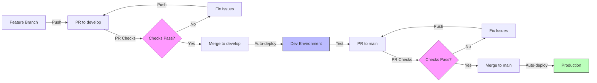
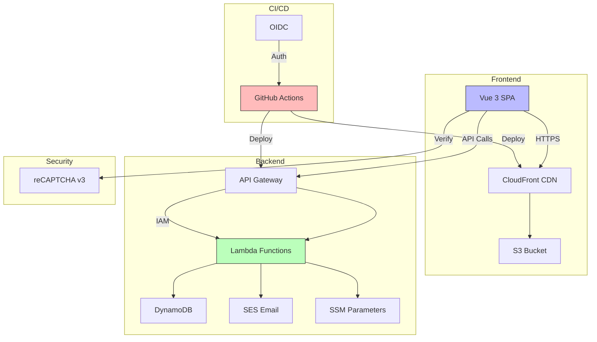

# idevelop.tech

[](https://github.com/mattlucian/idevelop.tech/actions/workflows/deploy-production.yml)
[](https://github.com/mattlucian/idevelop.tech/actions/workflows/pr-checks.yml)
[](https://github.com/mattlucian/idevelop.tech/actions/workflows/eslint.yml)
[](https://github.com/mattlucian/idevelop.tech/actions/workflows/codeql.yml)
[](https://app.deepsource.com/gh/mattlucian/idevelop.tech/)
[](https://opensource.org/licenses/MIT)

Full-stack portfolio application showcasing technical consulting services, cloud infrastructure expertise, and software development capabilities.

**Live Site**: https://dxeay6n8brs8g.cloudfront.net

---

## Why This Project?

This repository demonstrates production-ready full-stack development practices:

**🏗️ Architecture Excellence**
- Serverless-first design for cost-effectiveness and scalability
- Type-safe monorepo with shared types across frontend and backend
- Infrastructure as Code with SST v3 (Pulumi-based)

**🔒 Security & DevOps**
- AWS OIDC authentication (zero long-lived credentials)
- Automated security scanning (CodeQL, DeepSource)
- Branch protection with required status checks
- Comprehensive error handling and logging

**⚡ Developer Experience**
- Full TypeScript throughout (frontend, backend, infrastructure)
- Automated code quality (ESLint, Prettier, TypeScript)
- Hot reload development with Vite
- AI-assisted development guidelines (CLAUDE.md)

**🚀 CI/CD Automation**
- GitHub Actions for automated testing and deployment
- Separate dev and production environments
- Automated branch cleanup and PR workflows

---

## Key Features

### Frontend
- **Vue 3** with Composition API and `<script setup>` syntax
- **Tailwind CSS** design system with dual color schemes
- **Type-safe routing** with Vue Router
- **SEO optimization** with dynamic meta tags
- **PWA support** with offline caching (non-intrusive)
- **Responsive design** (mobile-first, 320px → 1440px+)

### Backend
- **AWS Lambda** serverless functions
- **API Gateway** HTTP endpoints
- **DynamoDB** for rate limiting
- **SES** for transactional email
- **reCAPTCHA v3** spam protection
- **Structured error handling** with typed responses

### Infrastructure
- **S3 + CloudFront** static hosting with HTTPS
- **SST v3** infrastructure as code
- **GitHub Actions** CI/CD with OIDC
- **Automated deployments** to dev and production stages

### Code Quality
- **TypeScript** strict mode (0 errors)
- **ESLint** with Vue and TypeScript rules
- **Prettier** code formatting
- **CodeQL** security analysis
- **DeepSource** code quality analysis

---

## CI/CD Workflow



**Status Checks** (required for merge):
- ✅ TypeScript type checking
- ✅ ESLint code quality
- ✅ Build validation
- ✅ CodeQL security scan
- ✅ DeepSource analysis

---

## Architecture



---

## Tech Stack

**Frontend**: Vue 3 (Composition API) + TypeScript + Tailwind CSS + Vite
**Backend**: AWS Lambda + API Gateway + DynamoDB + SES
**Infrastructure**: SST v3 + S3 + CloudFront + GitHub Actions
**Architecture**: Serverless monorepo with TypeScript throughout

---

## Project Structure

```
idevelop.tech/
├── packages/
│   ├── web/         # Vue 3 frontend
│   ├── functions/   # AWS Lambda functions
│   └── core/        # Shared TypeScript types
├── sst.config.ts    # Infrastructure as Code
├── docs/            # Documentation
└── .github/         # CI/CD workflows
```

---

## Quick Start

<details>
<summary><b>Prerequisites</b></summary>

- Node.js 20.19.0+ or 22.12.0+
- AWS CLI (for deployment)
- AWS account with appropriate permissions

</details>

<details>
<summary><b>Development Setup</b></summary>

```bash
# Clone repository
git clone https://github.com/mattlucian/idevelop.tech.git
cd idevelop.tech

# Install dependencies
npm install

# Frontend development
cd packages/web
npm run dev          # http://localhost:5173
npm run type-check   # TypeScript validation
npm run lint         # ESLint + auto-fix
npm run format       # Prettier
npm run build        # Production build
```

</details>

<details>
<summary><b>Environment Variables</b></summary>

Create `packages/web/.env.local`:

```env
VITE_API_URL=your-api-gateway-url
VITE_RECAPTCHA_SITE_KEY=your-recaptcha-site-key
VITE_GA_MEASUREMENT_ID=your-ga-id  # Optional
```

</details>

<details>
<summary><b>Deployment</b></summary>

**Automated via GitHub Actions:**
- Push to `develop` → Deploy to dev environment
- Push to `main` → Deploy to production

**Manual deployment:**
```bash
aws sso login --profile idevelop-tech
AWS_PROFILE=idevelop-tech npx sst deploy --stage production
```

</details>

---

## Configuration

### For Forking/Adaptation

1. **One-time manual setup**: See [docs/SETUP.md](docs/SETUP.md)
   - GitHub Actions OIDC
   - Email DNS (SPF, DMARC, DKIM)
   - reCAPTCHA keys
   - AWS SES verification

2. **Update application constants**: `packages/web/src/constants/index.ts`
   - Site name, URL, company name
   - Contact information
   - Social media links

3. **Environment variables**: `packages/web/.env.*`
   - `VITE_API_URL` - API endpoint
   - `VITE_RECAPTCHA_SITE_KEY` - reCAPTCHA public key
   - `VITE_GA_MEASUREMENT_ID` - Analytics (optional)

---

## Documentation

### Project Management
- **[TODO.md](TODO.md)** - Active tasks and pending work
- **[docs/BRANCH-STRATEGY.md](docs/BRANCH-STRATEGY.md)** - Git workflow and CI/CD

### Architecture
- **[docs/ARCHITECTURE.md](docs/ARCHITECTURE.md)** - Full-stack architecture decisions
- **[docs/frontend/](docs/frontend/)** - Frontend documentation
  - `COMPONENT-RULES.md` - Component patterns (2-3 rule)
  - `DESIGN-SYSTEM.md` - Design tokens and styling
  - `DATA-STRUCTURE.md` - Type schemas
  - `CONFIGURATION.md` - Key configuration files
- **[docs/backend/FUNCTIONS.md](docs/backend/FUNCTIONS.md)** - Lambda functions

### Development
- **[CLAUDE.md](CLAUDE.md)** - AI development guidelines and coding standards
- **[.github/SECURITY.md](.github/SECURITY.md)** - Security policy

---

## Contributing

Contributions are welcome! This project follows professional development practices:

### Branch Strategy

1. **Create feature branch** from `develop`:
   ```bash
   git checkout develop
   git pull origin develop
   git checkout -b feature/your-feature-name
   ```

2. **Make changes** with quality checks:
   ```bash
   # After changes
   npm run type-check   # Must pass
   npm run lint         # Must pass
   npm run format       # Must run
   ```

3. **Create Pull Request** to `develop`:
   - All status checks must pass
   - ESLint, TypeScript, CodeQL, DeepSource
   - PRs to `main` are only from `develop`

4. **Branch cleanup**: Feature branches auto-delete after merge

### Code Standards

- **TypeScript**: Strict mode, no `any` types, no non-null assertions (`!`)
- **Vue 3**: Composition API with `<script setup lang="ts">`
- **Components**: Follow 2-3 pattern rule (see `docs/frontend/COMPONENT-RULES.md`)
- **Styling**: Tailwind CSS, follow design system tokens
- **Error Handling**: Centralized logger, structured errors, proper validation

See [CLAUDE.md](CLAUDE.md) for complete development guidelines.

---

## Security

- AWS OIDC authentication (no long-lived credentials)
- Secrets managed via AWS SSM and GitHub Secrets
- Automated security scanning (CodeQL, DeepSource)
- Dependency scanning (Dependabot)
- Branch protection with required reviews
- Environment variable validation

See [.github/SECURITY.md](.github/SECURITY.md) for vulnerability reporting.

---

## License

MIT License - See [LICENSE](LICENSE) for details.

---

**Built with Vue 3, TypeScript, Tailwind CSS, SST, and AWS**
