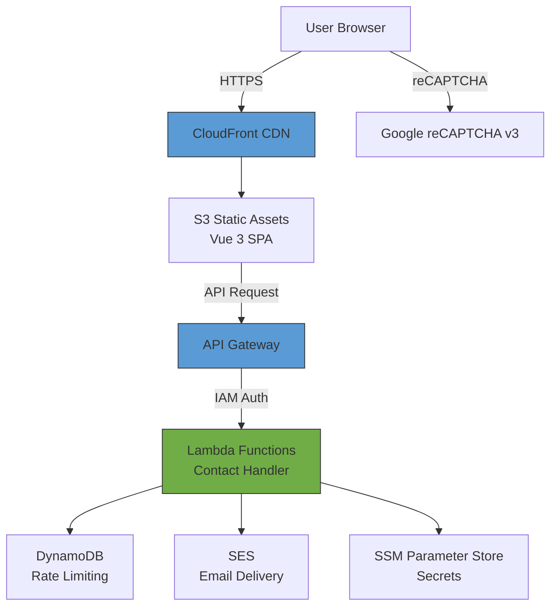
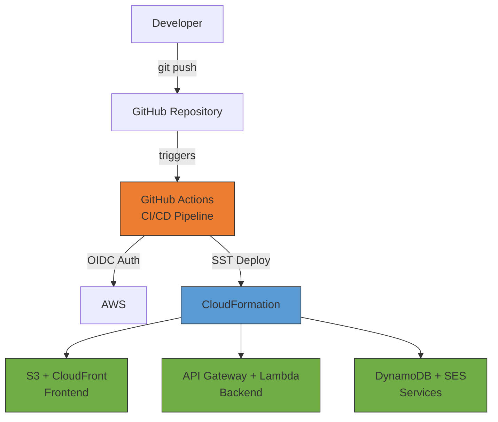
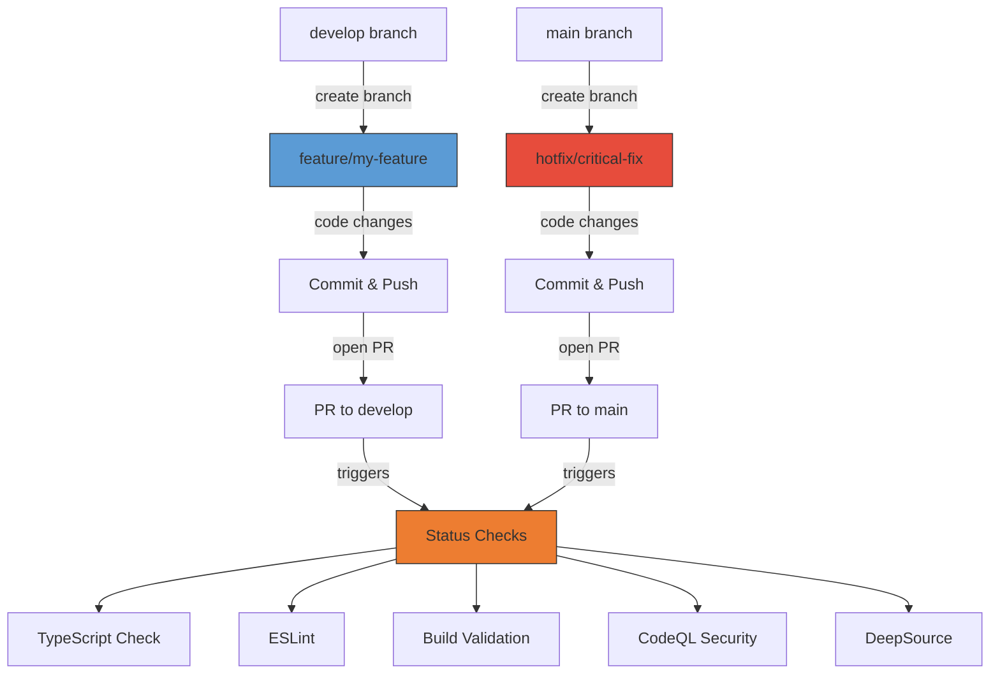
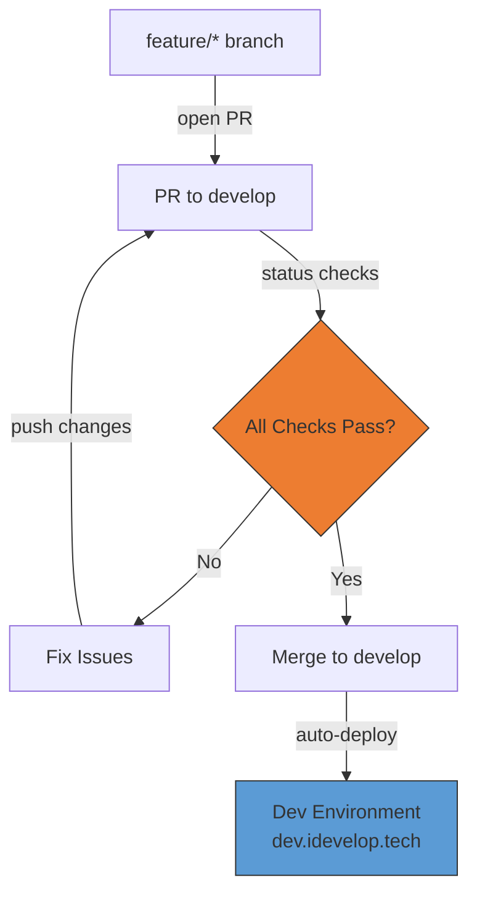
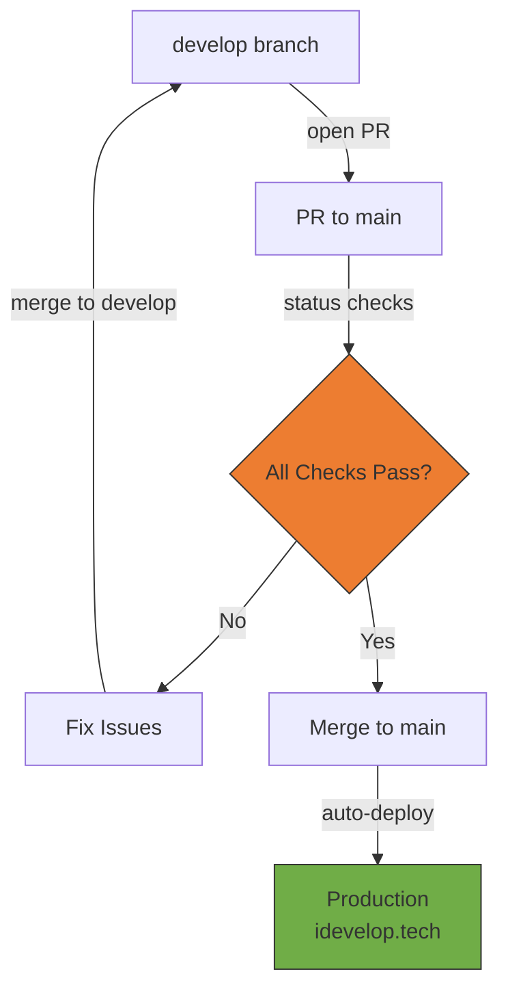

# idevelop.tech

[](https://github.com/mattlucian/idevelop.tech/actions/workflows/deploy-production.yml)
[](https://github.com/mattlucian/idevelop.tech/actions/workflows/pr-checks.yml)
[](https://github.com/mattlucian/idevelop.tech/actions/workflows/eslint.yml)
[](https://github.com/mattlucian/idevelop.tech/actions/workflows/codeql.yml)
[](https://app.deepsource.com/gh/mattlucian/idevelop.tech/)
[](https://opensource.org/licenses/MIT)

Full-stack portfolio application showcasing technical consulting services, cloud infrastructure expertise, and software development capabilities.

**Live Site**: https://idevelop.tech

---

## Why This Project?

Production-ready full-stack development practices:

- **🏗️ Architecture** - Serverless-first, type-safe monorepo, Infrastructure as Code (SST v3)
- **🔒 Security** - AWS OIDC auth, automated scanning (CodeQL, DeepSource), branch protection
- **⚡ Developer Experience** - Full TypeScript, automated quality checks, hot reload, AI guidelines
- **🚀 CI/CD** - GitHub Actions, separate dev/prod environments, automated workflows

---

## Quick Start

<details>
<summary><b>Prerequisites</b></summary>

- Node.js 20.19.0+ or 22.12.0+
- AWS CLI (for deployment)
- AWS account with appropriate permissions

</details>

<details>
<summary><b>Development Setup</b></summary>

```bash
# Clone repository
git clone https://github.com/mattlucian/idevelop.tech.git
cd idevelop.tech

# Install dependencies
npm install

# Frontend development
cd packages/web
npm run dev          # http://localhost:5173
npm run type-check   # TypeScript validation
npm run lint         # ESLint + auto-fix
npm run format       # Prettier
npm run build        # Production build
```

</details>

<details>
<summary><b>Environment Variables</b></summary>

Create `packages/web/.env.local`:

```env
VITE_API_URL=your-api-gateway-url
VITE_RECAPTCHA_SITE_KEY=your-recaptcha-site-key
VITE_GA_MEASUREMENT_ID=your-ga-id  # Production only (disabled in dev)
```

</details>

<details>
<summary><b>Deployment</b></summary>

**Automated via GitHub Actions:**
- Push to `develop` → Deploy to dev environment
- Push to `main` → Deploy to production

**Manual deployment:**
```bash
aws sso login --profile idevelop-tech
AWS_PROFILE=idevelop-tech npx sst deploy --stage production
```

</details>

---

## Tech Stack

```
Frontend
┌─────────────────────────────────────────────────────────────────┐
│ Vue 3 • TypeScript • Tailwind CSS • Vite • Vue Router           │
└─────────────────────────────────────────────────────────────────┘

Backend & API
┌─────────────────────────────────────────────────────────────────┐
│ AWS Lambda • API Gateway • DynamoDB • SSM Parameters            │
└─────────────────────────────────────────────────────────────────┘

Infrastructure & Services
┌─────────────────────────────────────────────────────────────────┐
│ SST v3 • S3 • CloudFront • SES • GitHub Actions                 │
└─────────────────────────────────────────────────────────────────┘

Observability & Security
┌─────────────────────────────────────────────────────────────────┐
│ New Relic • Google Analytics 4 • CodeQL • DeepSource • reCAPTCHA│
└─────────────────────────────────────────────────────────────────┘
```

---

## Architecture

### Request Flow



### Deployment Architecture



---

## Project Structure

```
idevelop.tech/
├── packages/
│   ├── web/         # Vue 3 frontend
│   ├── functions/   # AWS Lambda functions
│   └── core/        # Shared TypeScript types
├── sst.config.ts    # Infrastructure as Code
├── docs/            # Documentation
└── .github/         # CI/CD workflows
```

---

## CI/CD Workflow

### 1. Branch Creation & Pull Request



**Branch Types**:
- `feature/*` - New features (from develop)
- `docs/*` - Documentation (from develop)
- `hotfix/*` - Production fixes (from main)

### 2. Development Workflow (PR → develop)



**What Happens**:
- All status checks must pass (TypeScript, ESLint, Build, CodeQL, DeepSource)
- After merge, automatic deployment to dev environment
- Test changes at https://dev.idevelop.tech

### 3. Production Deployment (develop → main)



**What Happens**:
- Additional CodeQL security scan required for production
- After merge, automatic deployment to production
- Live at https://idevelop.tech (custom domain) or CloudFront URL

**Status Checks** (required for all PRs):
- ✅ TypeScript type checking
- ✅ ESLint code quality
- ✅ Build validation
- ✅ CodeQL security scan (main only)
- ✅ DeepSource analysis

---

## Documentation

**Architecture & Development**:
- [ARCHITECTURE.md](docs/ARCHITECTURE.md) - Full-stack architecture decisions
- [CLAUDE.md](CLAUDE.md) - AI development guidelines and coding standards
- [BRANCH-STRATEGY.md](docs/BRANCH-STRATEGY.md) - Git workflow and CI/CD

**Frontend**:
- [Component Rules](docs/frontend/COMPONENT-RULES.md) - Component patterns (2-3 rule)
- [Design System](docs/frontend/DESIGN-SYSTEM.md) - Design tokens and styling
- [Data Structure](docs/frontend/DATA-STRUCTURE.md) - Type schemas

**Backend & Operations**:
- [Lambda Functions](docs/backend/FUNCTIONS.md) - API implementation
- [Observability](docs/OBSERVABILITY.md) - Monitoring and analytics (New Relic + GA4)

**Setup & Configuration**:
- [SETUP.md](docs/SETUP.md) - Initial project setup and configuration
- [TODO.md](TODO.md) - Active tasks and pending work

**Security**:
- [SECURITY.md](.github/SECURITY.md) - Security policy and vulnerability reporting

---

## License

MIT License - See [LICENSE](LICENSE) for details.
